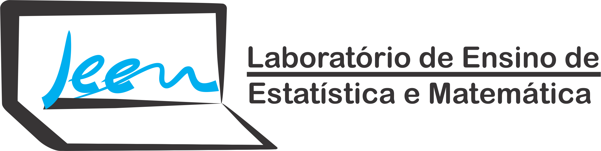

# LEEM - Laboratório de Ensino de Estatística e Matemática

Esse projeto tem por objetivo de criar uma interface gráfica ao usuário no [R](http://r-project.org/), usando o pacote [shiny](https://shiny.rstudio.com/) e o pacote *tcltk* da base do [R](http://r-project.org/). Tentaremos apresentar temas simples e complexos de forma interativa, para que o professor dessas área possam abordar o tema de modo mais facilmente.

## Projetos integrados

Temos dentro desse projetos, diversos projetos integrados, sendo:

- Projeto de dissertação PROFMAT/CAP/UFSJ, da orientanda [Juliane Nassaralla Almeida](http://lattes.cnpq.br/5176118169651142);
- Grupo de Iniciação Científica em Estatística/R:
  - [Amanda Kelly Costa](https://www.linkedin.com/in/amandakellycosta/) 
  - ...

